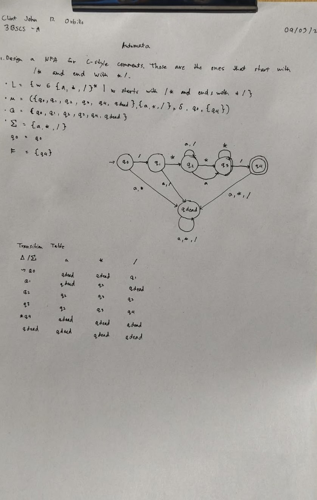
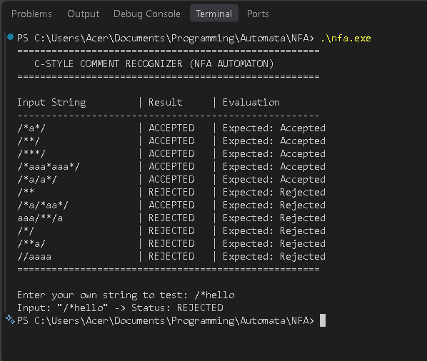

# C-Style Comment Recognizer (Automata Assignment)

This repository contains a C implementation and formal documentation for a Non-Deterministic Finite Automaton (NFA) that recognizes C-style comments over the alphabet $\Sigma = \{a, *, /\}$.

## Written Assignment & State Diagram


## Program Execution & Output


## How to Run
1. Compile the C code using GCC:
   ```bash
   gcc main.c -o nfa